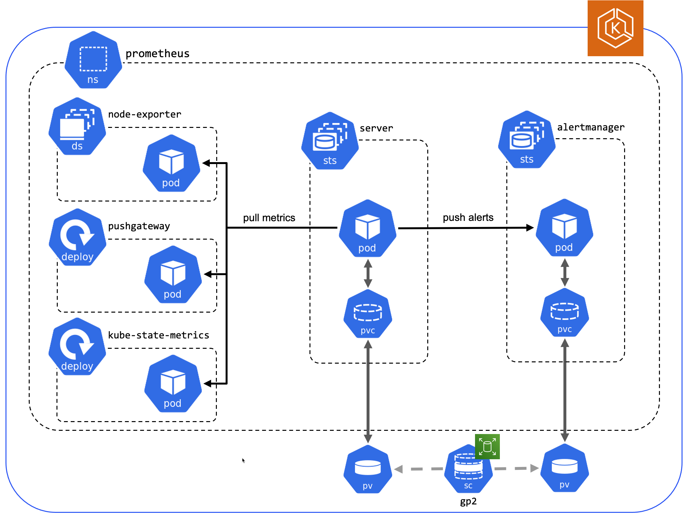

# EKS add-in template

TODO: init project by running the following from a Linux/MACOS host:

- [x] init project `PROJECT_NAME="Company Product" QSID=qs-someid make init`
- [x] setup dev environment `make dev`.
- [x] deploy an eks cluster to use during development `CLUSTER_NAME=eks-dev AWS_REGION=us-west-2 AWS_PROFILE=my-aws-cli-profile make eks`
- [x] author deployment template `templates/eks-PRODUCT_NAME.template.yaml`
- [ ] test deployment
  - [x] run lint tests `make lint`
  - [x] add any additional required parameters to `parameters` section of `.taskcat.yml`
  - [x] set region in `.takcat.yml` to match the region used for eks cluster.
  - [x] set auth profile in `~/.taskcat.yml` to match profile used for eks cluster
  - [x] set `KubeClusterName` in taskcat_overrides.yml
  - [x] launch the template `CLUSTER_NAME=eks-dev make test`
  - [x] cleanup test stack `make clean-stack`
- [ ] remove eks cluster `CLUSTER_NAME=eks-dev AWS_REGION=us-west-2 AWS_PROFILE=my-aws-cli-profile make clean-eks`
- [x] create architecture diagram and replace sample `docs/images/architecture_diagram.png`. you can use the pptx template from [here](todo).
- [ ] complete docs in `docs/partner_editable/`
- [ ] get review from Quick Start team
- [ ] add permalinks to `docs/partner_editable/_settings.adoc` and `README.md`
- [ ] make repo public
- [ ] add parameter and submodule to the EKS marketplace Quick Start
- [ ] remove this checklist from `README.md`

# Prometheus on Amazon EKS

This Quick Start offers three deployment options:

[Deploy into a new VPC and new EKS cluster](todo.newvpclink)

[Deploy into a new VPC in an existing EKS cluster](todo.existingvpclink)

[Deploy into an existing EKS cluster](todo.existingclusterlink)

For architectural details, best practices, step-by-step instructions, and customization options, see the [deployment guide](https://aws-quickstart.github.io/prometheus/).

To post feedback, submit feature ideas, or report bugs, use the **Issues** section of this GitHub repo.
If you'd like to submit code for this Quick Start, please review the [AWS Quick Start Contributor's Kit](https://aws-quickstart.github.io/).
